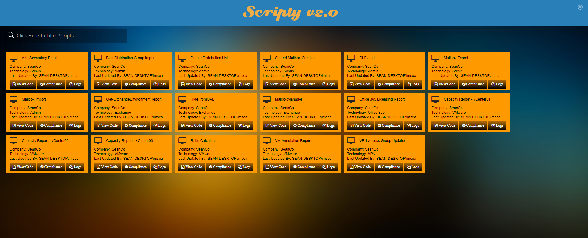
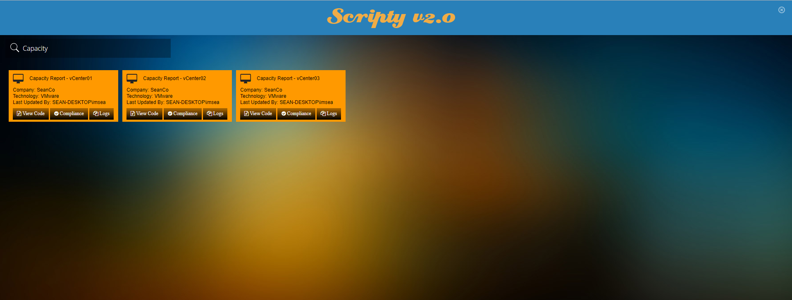
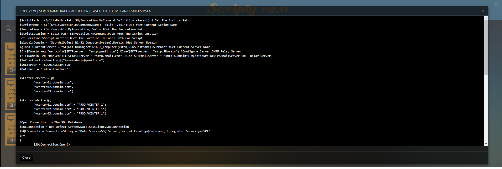
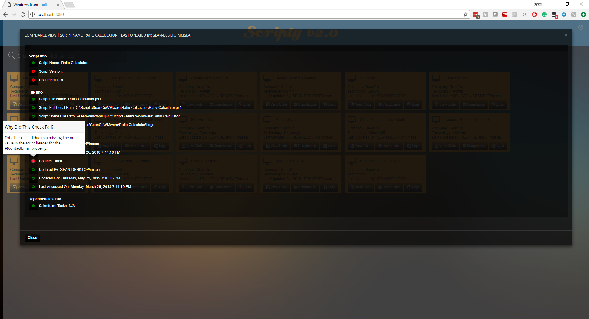
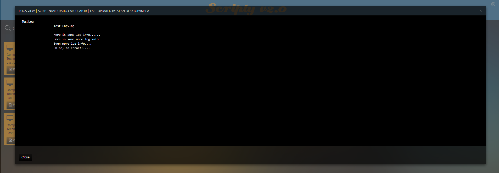

## Introduction
This repo contains the source code for a Powershell Self Documenting Library. If you've ever had a ton of powershell scripts and wanted to know about them at a glance, be able to sort through them, and look at logs all from one place. This is the project for you. Now with more filtering and compliance options to ensure your scripts have the proper markup.

## Setup
* Install [PoshServer](http://poshserver.net)
* Git Clone Scripty into the PoshServer http directory.
* Open up your webserver and point it to http://localhost:8080/scripty/ or whatever your server ip and port is.
* Follow Steps Below To Populate The Script Library Properly

## Script Script Population
- Scripty follows a certain folder structure and template file structure ot get the most information from your scripts. Please use the   following folder structure when adding files, if you choose to ignore the structure the applicaiton will not work properly!

- Root Directory - C:\Scripts
- Company Folder - C:\Scripts\CompanyFolderName
- TechnologyFolder - C:\Scripts\CompanyFolderName\TechnologyFolderName
- ScriptFolder - C:\Scripts\CompanyFolderName\TechnologyFolderName\ScriptFolderName\
  - Script - C:\Scripts\CompanyFolderName\TechnologyFolderName\ScriptFolderName\ScriptName.ps1
- ScriptLogFolder - C:\Scripts\CompanyFolderName\TechnologyFolderName\ScriptFolderName\Logs\
  - ScriptLogFile - C:\Scripts\CompanyFolderName\TechnologyFolderName\ScriptFolderName\Logs\LogFileName.txt

Example
```
C:\Scripts\SeanCo\VMware\VMInventory\Capacity Report - DC01.ps1
C:\Scripts\SeanCo\VMware\VMInventory\Logs\03-25-18_040022 - Capacity Report - DC01
```

## Script Template Format
Most fields in this are self explainatory and all values must be at the top of the script. A template has been provided in case you need it.
```
#Region Script Info
###################################################
#!CreatedBy: Sean Davis
#!ContactEmail: imseandavis@gmail.com
#!Version: 1.0
#!DocumentationURL: http://docs.com/docurl.html
#!Description: This is a sample script that does stuff.
###################################################
#endregion
```
- Scripty Will Parse Out The Data For Use In The Dashboard
- Scripty Will Also Detect Scheduled Tasks That May Be Dependencies of Your Scripts


## TODO
* Integrate The Code And Webserver Into A Single Click Deploy

## Demo
Dashboard


Dashboard (With Filtering)


View Code


Script Compliance Checking


View Logs



## Credit
-Build On Top Of PowerShell Server, One Of The Greatest Free PowerShell Tools Ever. Credit To Yusuf for [PoshServer](http://poshserver.net)


