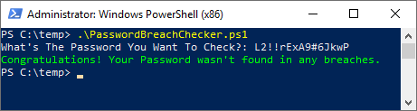
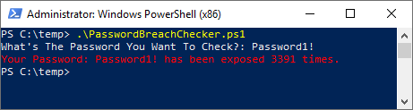

## HAVEIBEENPWNED Breached Password Checker
I created this very simple script to check to see if your password is listed in any breach or combo list publish by Troy Hunt's HAVEIBEENPWNED website. Just put a password into the checker and it will go out and retrieve all instances of the password found on HAVEIBEENPWNED.COM using the older version of the [HAVEIBEENPWNED API](https://haveibeenpwned.com/API/v2). 
* If you'd rather have a turnkey Powershell Module, check out [Mark's Gallery Page](https://www.powershellgallery.com/packages/HaveIBeenPwned/1.3.1) or simply open PowerShell and run:  `Install-Module -Name HaveIBeenPwned`
* Finally, if you want to integrate a this solution into your Active Directory (for free) for your entire company, check out [Jackson's page](https://jacksonvd.com/checking-for-breached-passwords-ad-using-k-anonymity/).

## Instructions
Run the script and put your password in and it will notify you how many times your password has been found in a public list or data breach.
  
Here's how the magic happens... 
* You Enter Your Password (I Let It Display In Clear Text So You Can Tell If You Typed It Correctly)
* A Hash Is Created From Your Password So You Don't Expose Your Password To The HAVEIBEENPWND Service
* The First 5 Bytes Of The Hash Are Sent To The API So You Don't Compromise Your Hash
* All Hashes That Start With The 5 Bytes Sent Are Returned
* PowerShell Locally Checks For Exact Matches To Your Password Hash And Reports How Many Times It Was Found

# Good Response

 
# Bad Response

